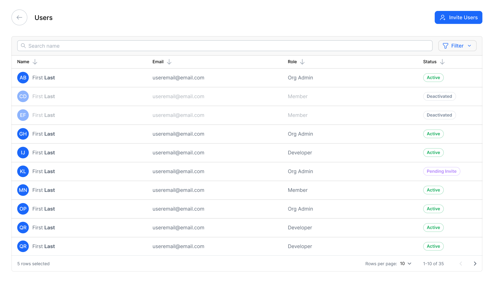

# Flywheel Frontend Assessment Project

## Getting started

Install node modules
```
npm i
```

For the app to function correctly it is necessary to start the API server which is consumed by the frontend app.

Start API server
```
npm run api
```

While the API server is running start the frontend app

Start frontend app
```
npm run start
```

After everything is running the frontend UI will be accessible at [localhost:4200](http://localhost:4200/).


## Assessment Objective

The goal will be to improve the users page of the frontend app, [localhost:4200/users](http://localhost:4200/users). In its current state the UI does not enable the user to add, update, or remove users for the user list. Within the `./src/app/users/` directory there are existing components which can be updated to enable the user to add, update, and remove users for the user list. Additionally, an API service already exists within the app which can be used to interface with the appropriate endpoints, `./src/app/api.service.ts`.

## Expectations

*_Please note_* the expectation for this assessment is *_not_* to simply implement a list of features from a prescribed acceptance criteria, but rather it is to improve the users page as much as what is reasonable within the given time constraints of the assessment. Furthermore, the *_quality of your work_* will be regarded much higher than the volume of work you complete.

During the process of improving the users page you may encounter bugs, broken styles, or potentially even bad coding practices, please consider addressing these types of issues as well.

Please remember the expectation is not to complete all designs provide below, but to improve the users page in accordance with objective described above and the provide designs. Also, you have license to consider alternative designs based on your own best judgement, perhaps considering what may be a simpler solution for the user's experience.


## The Desired Design

Please carefully examine the mocked designs below for guidance on how improvements should look and feel. All of the components used in these designs come from a 3rd party component library, so you should not have to spend time creating and styling minor components like inputs, buttons, or menus from scratch. For resources and documentation on this UI library can be found at [https://cdn.flywheel.io/docs/vision/1.3.2/?path=/docs/getting-started--docs](https://cdn.flywheel.io/docs/vision/1.3.2/?path=/docs/getting-started--docs). Please leverage this UI library as needed.

Please note the designs below are not exhaustive and you will need to determine for yourself an appropriate way to trigger some of the dialogs you see below if you choose to implement them.

#### Users Page



#### Add New User Dialog


#### Edit User Dialog


#### Deactivate User Dialog


#### User Information Dialog


Please evaluate the existing UI against the above designs to guide your decisions as you improve the users page.


# Good luck!
